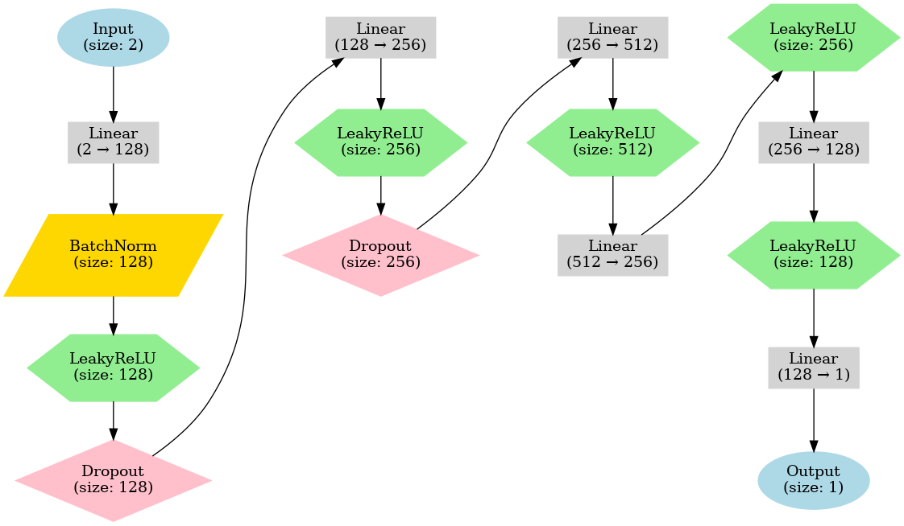

<div align="center">
  
  <h1>Zephyrus</h1>
  
  <a href="https://scikit-learn.org/stable/">
    
  </a>
  <a href="https://numpy.org/">
    
  </a>
  <a href="https://pandas.pydata.org/">
    
  </a>
  <a href="https://pytorch.org/">
    
  </a>
</div>

<br>

<div align="center">Created by Shaunik Musukula and Aarush Gupta</div>

<br>

<div align="center">

[](https://www.youtube.com/watch?v=rujY4nIlzQ0)

</div>

---

## 📚 Table of Contents
- [<code>⚙️ Introduction</code>](#%EF%B8%8F-introduction)
- [<code>📐 The Math / Structure</code>](#%EF%B8%8F-t)
- [<code>📂 Directory Structure</code>](#-directory-structure)
- [<code>🚀 Usage</code>](#-usage)
- [<code>📊 Benchmarks</code>](#-benchmarks)
- [<code>🙏 Acknowledgments</code>](#-acknowledgments)

---

## ⚙️ Introduction

Zephyrus uses model archutectures that use a Geospatial Neural Network (GNN), Finite Difference Method (FDM), and Guassion Process Regression (GPR). Additionally, it experiments with the use of a `log-cosh` loss function and the `Huber` loss function. The ultimate goal is to create a more accurate representation of air quality in socioeconomically disadvantaged areas.

---

## 📐 The Math / Structure

### Geospatial Neural Network (GNN)



### FDM (Finite Difference Method)

We used FDM to create a dense grid with the sparse data points via spatial interpolation. Euler's method employed in this project is defined as:

$$\vec{y}_{n+1} = \vec{y}_n + h \vec{F}(\vec{y}_n, t_n).$$

Using FDM, we compute AQI values over a grid defined by lat and long. For each grid point \((i, j)\):

1. Define the grid as:

$$
\text{\Large Latitude grid: } \{x_i \mid i = 1, \dots, n\}, \quad 
\text{\Large Longitude grid: } \{y_j \mid j = 1, \dots, m\}
$$


2. We calculate weights based on the inverse distance:

$$W_{i,j} = \frac{1}{\sqrt{(x - x_i)^2 + (y - y_j)^2} + \epsilon},$$

where $$\epsilon = 1 \times 10^{-5}$$ to prevent division by zero.

3. Aggregation of AQI values:

$$AQI_{i,j} = \frac{\sum_{k=1}^{n} W_{i,j} \cdot AQI_k}{\sum_{k=1}^{n} W_{i,j}}$$

---

## 📂 Directory Structure

```
GeoSpatialNN/
├── .github/
├── .next/
├── components/
├── model/                    # model-related files
│   └── data/                 # all data necessary for model implementation
│   └── src/                  # src files for the model
│       └── geospatialnn.ipynb # primary notebook for the model
├── out/
├── pages/
├── public/
├── styles/
├── .gitignore
├── package.json
├── yarn.lock
├── postcss.config.js
├── tailwind.config.js
└── LICENSE
```

---

## 📊 Benchmarks

### Summary of Results
| Methodology                | Loss       |
|----------------------------|------------|
| GNN w/tan-cosh Loss        | 0.0115    |
| Smaller GNN w/ Huber Loss  | 0.0119    |

